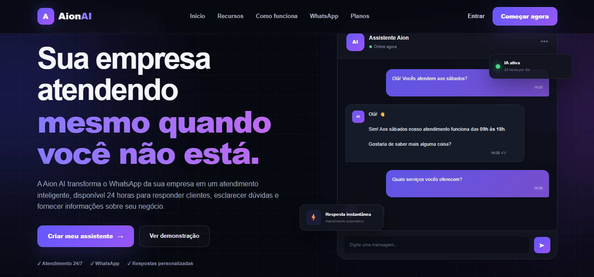
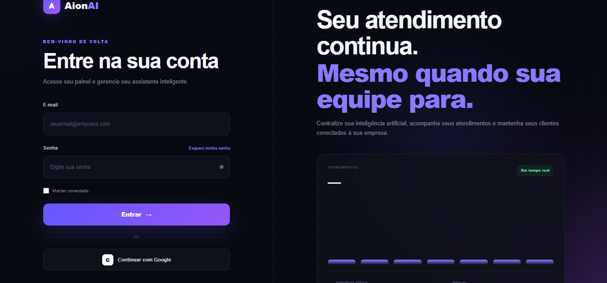
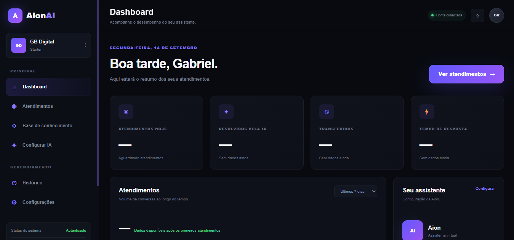

# 🤖 Aion AI

Plataforma web de inteligência artificial e automação desenvolvida para auxiliar empresas na otimização de processos, atendimento e produtividade.

A Aion AI foi criada com o objetivo de aplicar inteligência artificial a problemas reais de negócios, oferecendo uma estrutura moderna, escalável e preparada para evolução contínua.

## 🚀 Funcionalidades

### 🤖 Inteligência Artificial

- Integração com modelo de inteligência artificial
- Assistente Aion integrado à plataforma
- Processamento de solicitações através de função backend
- Comunicação segura entre frontend, Supabase e serviço de IA
- Chaves sensíveis mantidas fora do código-fonte através de variáveis de ambiente

### 👤 Autenticação

- Sistema de cadastro e login
- Autenticação integrada ao Supabase
- Controle de sessão do usuário
- Área da plataforma protegida por autenticação

### 📊 Dashboard

- Interface central da plataforma
- Navegação entre os recursos disponíveis
- Estrutura preparada para expansão de novos módulos e automações
- Experiência voltada para utilização empresarial

## 🏗️ Arquitetura

A aplicação utiliza o **Supabase** como parte da infraestrutura de backend.

A comunicação com a inteligência artificial é realizada através de uma **Supabase Edge Function**, evitando a exposição da chave privada da API diretamente no frontend.

Fluxo simplificado:

```text
Usuário
   ↓
Frontend Aion AI
   ↓
Supabase
   ↓
Edge Function (aion-chat)
   ↓
API de Inteligência Artificial
   ↓
Resposta para a plataforma
```

## 🛠️ Tecnologias Utilizadas

- HTML5
- CSS3
- JavaScript
- Supabase
- Supabase Auth
- Supabase Edge Functions
- TypeScript
- API de Inteligência Artificial
- Git
- GitHub

## 📁 Estrutura do Projeto

```text
Aion-AI/
├── css/
├── html/
├── javascript/
├── supabase/
│   ├── functions/
│   │   └── aion-chat/
│   │       └── index.ts
│   └── config.toml
├── logo.jpeg
├── .gitignore
└── README.md
```

## 🔐 Segurança

O projeto foi estruturado para evitar a exposição de credenciais sensíveis.

Chaves privadas utilizadas pelos serviços de backend não são armazenadas diretamente no código-fonte público.

Arquivos de ambiente, dependências e arquivos temporários são protegidos através do `.gitignore`.

## 🎯 Objetivo

A Aion AI nasceu como um projeto voltado à aplicação prática de inteligência artificial e automação em empresas.

A proposta é desenvolver uma plataforma capaz de centralizar soluções inteligentes que reduzam tarefas repetitivas, melhorem processos e auxiliem empresas em suas operações.

## 📸 Demonstração

### 🏠 Home



### 🔐 Login



### 📊 Dashboard



## 🔄 Próximas Evoluções

- Expansão das funcionalidades do assistente de IA
- Novos módulos de automação
- Evolução do dashboard
- Gerenciamento de usuários e empresas
- Métricas de utilização
- Aprimoramento da experiência do usuário
- Novas integrações com serviços externos

## 👨‍💻 Autor

**Gabriel Rabello Peres**

GitHub: `@gabrielrabello879`

---

⭐ **Aion AI — Inteligência aplicada a problemas reais.**